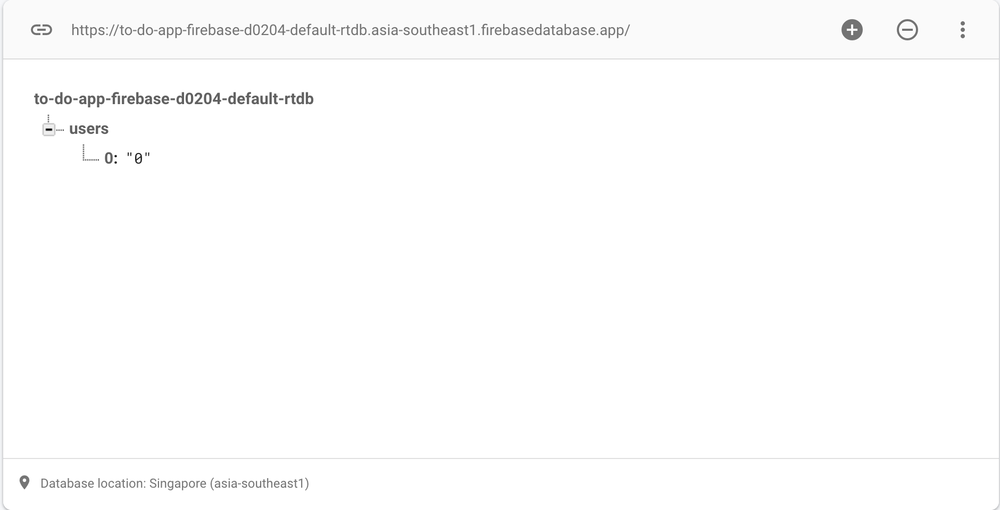
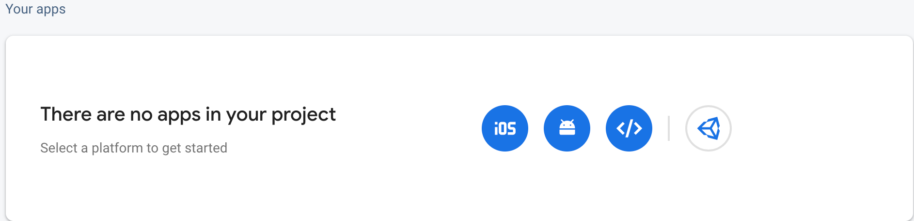
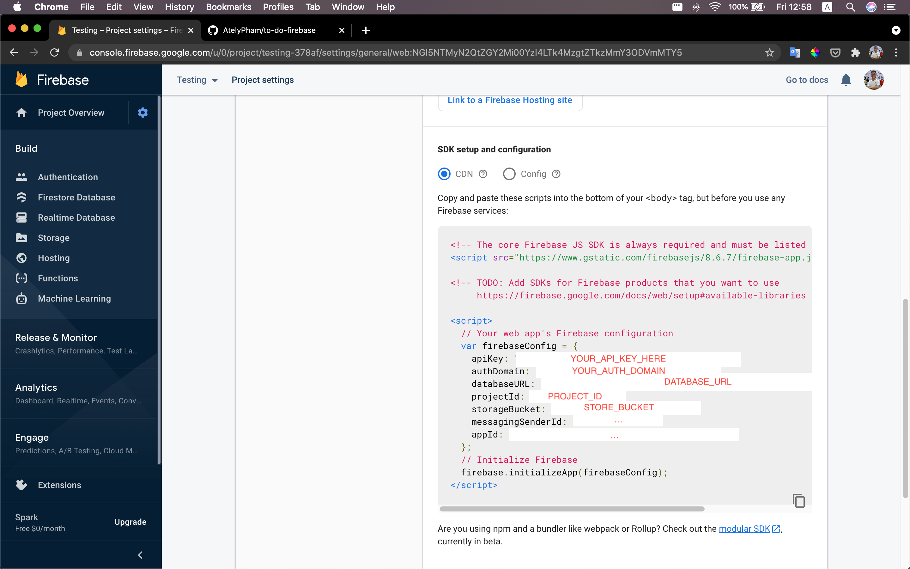

# To do app made with ReactJS and Firebase 🔥

🌐 This project was bootstrapped with [Create React App](https://github.com/facebook/create-react-app), and public at [here](https://to-do-app-firebase-12f4f.web.app/). Use the [Firebase Realtime Database](https://firebase.google.com/docs/database) and [Firebase Authentication](https://firebase.google.com/docs/auth) as backend services.

## Table of content

- 📌 [General Info](#general-info)
- 💻 [Tech Stack](#tech-stack)
- ⚙️ [Setup](#setup)

## General Info

This is a simple project for todo list, use Firebase as backend services. You can create a to do list, modify a to do item, filter your to do list. And a feature to toggle dark/light theme.

## Tech Stack

- ⚛️ [ReactJS](https://reactjs.org/) - For UI
- 🎉 [Material-UI](https://material-ui.com/) - For styling
- 🔥 [Firebase](https://firebase.google.com/) - For storing data and authentication

## Setup

### Firebase setup

Go to the [firebase](https://firebase.google.com/), sign in and create new project.

#### Create firebase project 🛠

Next enter your Project's name and choose disable Google analytics.

#### Setup the Authentication 👤

Go the the Authentication tab on the left sidebar.

Click Get Started. Enable Google Sign-in Method, you can add another setting Sign-in Methods here.

#### Setup the Database 🎒

Choose the Realtime Database on the sidebar.
Click Create Database, choose the Server Location you prefer and next choose the Testing mode.

Click the + sign to create a new entry in the database, and enter

```
Name: users | Value: {"0": "0"}
```

Click add, and the result looks like this.



### Clone this repository

Clone this project to your computer, run the following command:

```
git clone https://github.com/AtelyPham/to-do-firebase.git && cd to-do-firebase
npm install
```

### Setup the repository

#### In the firebase web 🔥

Click the gear icon (⚙️) next to the Project Overview on the left sidebar, choose Project Setting. Choose General tab and scroll down, choose the `</>` option for the web.



Enter your register app (any name your prefer). And your can check hosting if you like.

After that, copy the block of Firebase SDK where the content looks similar below.

```
var firebaseConfig = {
  apiKey: YOUR_API_KEY,
  authDomain: YOUR_DOMAIN,
  databaseURL: YOUR_DATABASE_URL,
  projectId: YOUR_PROJECT_ID,
  storageBucket: YOUR_STORAGE_BUCKET,
  messagingSenderId: YOUR_MESSAGE_SENDER_ID,
  appId: YOUR_APP_ID,
}
```

You can also find the above block in the General Project setting at SDK setup and configuration choose CDN see the content.



Copy that block of code and base into the `/src/fireabase/firebase.js`.

Finally you can run `npm start` to start the dev server of the project.

# Issue

If you have any problem, you can ask the the issue section of this repository or conntact the [facebook](https://www.facebook.com/phamtrung.tin.739) for help! 💪🏼
